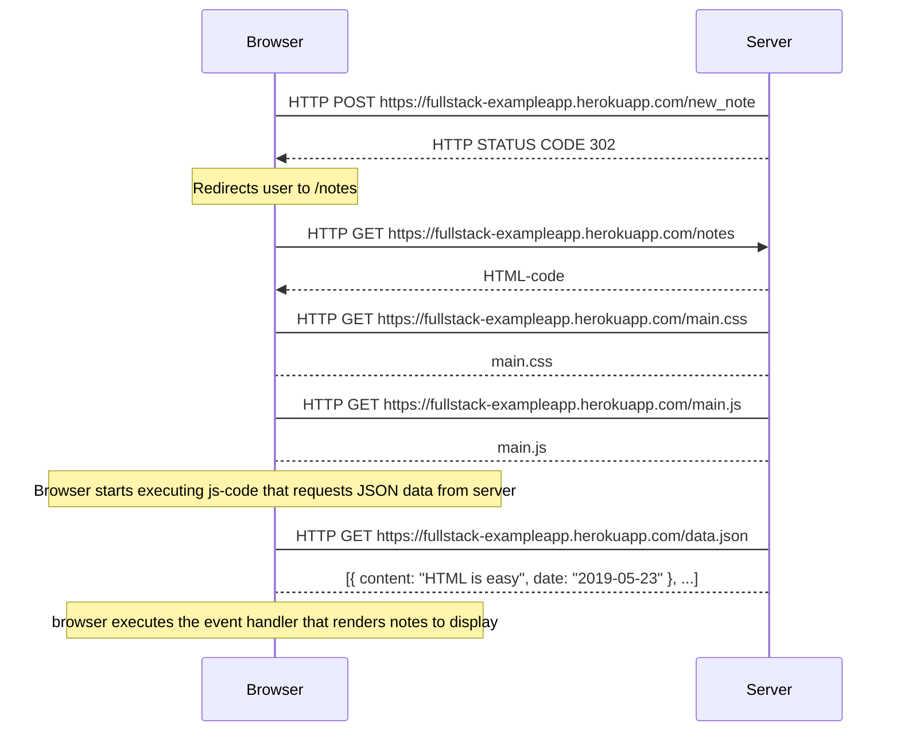

# New Note

```mermaid
sequenceDiagram
Browser->Server: HTTP POST https://fullstack-exampleapp.herokuapp.com/new_note
Server -->> Browser: HTTP STATUS CODE 302

note over Browser: Redirects user to /notes

Browser ->> Server: HTTP GET https://fullstack-exampleapp.herokuapp.com/notes
Server -->> Browser: HTML-code
Browser->Server: HTTP GET https://fullstack-exampleapp.herokuapp.com/main.css
Server-->Browser: main.css
Browser->Server: HTTP GET https://fullstack-exampleapp.herokuapp.com/main.js
Server-->Browser: main.js

note over Browser: Browser starts executing js-code that requests JSON data from server

Browser->Server: HTTP GET https://fullstack-exampleapp.herokuapp.com/data.json
Server-->Browser: [{ content: "HTML is easy", date: "2019-05-23" }, ...]

note over Browser: browser executes the event handler that renders notes to display
```
