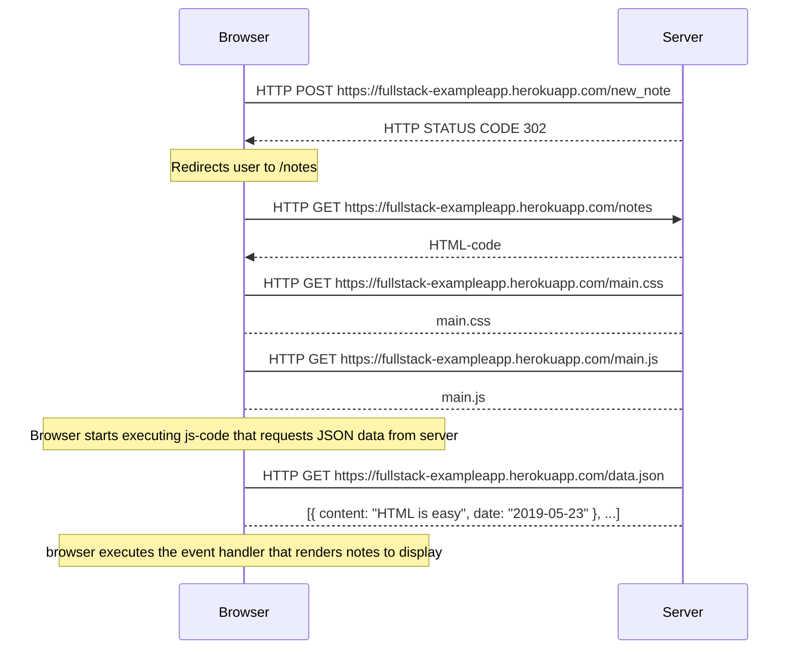

# New Note

[!["Sequence diagram for mermaid code"](https://mermaid.ink/img/eyJjb2RlIjoic2VxdWVuY2VEaWFncmFtXG5Ccm93c2VyLT5TZXJ2ZXI6IEhUVFAgUE9TVCBodHRwczovL2Z1bGxzdGFjay1leGFtcGxlYXBwLmhlcm9rdWFwcC5jb20vbmV3X25vdGVcblNlcnZlciAtLT4-IEJyb3dzZXI6IEhUVFAgU1RBVFVTIENPREUgMzAyXG5cbm5vdGUgb3ZlciBCcm93c2VyOiBSZWRpcmVjdHMgdXNlciB0byAvbm90ZXNcblxuQnJvd3NlciAtPj4gU2VydmVyOiBIVFRQIEdFVCBodHRwczovL2Z1bGxzdGFjay1leGFtcGxlYXBwLmhlcm9rdWFwcC5jb20vbm90ZXNcblNlcnZlciAtLT4-IEJyb3dzZXI6IEhUTUwtY29kZVxuQnJvd3Nlci0-U2VydmVyOiBIVFRQIEdFVCBodHRwczovL2Z1bGxzdGFjay1leGFtcGxlYXBwLmhlcm9rdWFwcC5jb20vbWFpbi5jc3NcblNlcnZlci0tPkJyb3dzZXI6IG1haW4uY3NzXG5Ccm93c2VyLT5TZXJ2ZXI6IEhUVFAgR0VUIGh0dHBzOi8vZnVsbHN0YWNrLWV4YW1wbGVhcHAuaGVyb2t1YXBwLmNvbS9tYWluLmpzXG5TZXJ2ZXItLT5Ccm93c2VyOiBtYWluLmpzXG5cbm5vdGUgb3ZlciBCcm93c2VyOiBCcm93c2VyIHN0YXJ0cyBleGVjdXRpbmcganMtY29kZSB0aGF0IHJlcXVlc3RzIEpTT04gZGF0YSBmcm9tIHNlcnZlclxuXG5Ccm93c2VyLT5TZXJ2ZXI6IEhUVFAgR0VUIGh0dHBzOi8vZnVsbHN0YWNrLWV4YW1wbGVhcHAuaGVyb2t1YXBwLmNvbS9kYXRhLmpzb25cblNlcnZlci0tPkJyb3dzZXI6IFt7IGNvbnRlbnQ6IFwiSFRNTCBpcyBlYXN5XCIsIGRhdGU6IFwiMjAxOS0wNS0yM1wiIH0sIC4uLl1cblxubm90ZSBvdmVyIEJyb3dzZXI6IGJyb3dzZXIgZXhlY3V0ZXMgdGhlIGV2ZW50IGhhbmRsZXIgdGhhdCByZW5kZXJzIG5vdGVzIHRvIGRpc3BsYXkiLCJtZXJtYWlkIjp7InRoZW1lIjoiZGVmYXVsdCJ9LCJ1cGRhdGVFZGl0b3IiOmZhbHNlfQ "Sequence diagram for mermaid code")](https://mermaid-js.github.io/mermaid-live-editor/#/edit/eyJjb2RlIjoic2VxdWVuY2VEaWFncmFtXG5Ccm93c2VyLT5TZXJ2ZXI6IEhUVFAgUE9TVCBodHRwczovL2Z1bGxzdGFjay1leGFtcGxlYXBwLmhlcm9rdWFwcC5jb20vbmV3X25vdGVcblNlcnZlciAtLT4-IEJyb3dzZXI6IEhUVFAgU1RBVFVTIENPREUgMzAyXG5cbm5vdGUgb3ZlciBCcm93c2VyOiBSZWRpcmVjdHMgdXNlciB0byAvbm90ZXNcblxuQnJvd3NlciAtPj4gU2VydmVyOiBIVFRQIEdFVCBodHRwczovL2Z1bGxzdGFjay1leGFtcGxlYXBwLmhlcm9rdWFwcC5jb20vbm90ZXNcblNlcnZlciAtLT4-IEJyb3dzZXI6IEhUTUwtY29kZVxuQnJvd3Nlci0-U2VydmVyOiBIVFRQIEdFVCBodHRwczovL2Z1bGxzdGFjay1leGFtcGxlYXBwLmhlcm9rdWFwcC5jb20vbWFpbi5jc3NcblNlcnZlci0tPkJyb3dzZXI6IG1haW4uY3NzXG5Ccm93c2VyLT5TZXJ2ZXI6IEhUVFAgR0VUIGh0dHBzOi8vZnVsbHN0YWNrLWV4YW1wbGVhcHAuaGVyb2t1YXBwLmNvbS9tYWluLmpzXG5TZXJ2ZXItLT5Ccm93c2VyOiBtYWluLmpzXG5cbm5vdGUgb3ZlciBCcm93c2VyOiBCcm93c2VyIHN0YXJ0cyBleGVjdXRpbmcganMtY29kZSB0aGF0IHJlcXVlc3RzIEpTT04gZGF0YSBmcm9tIHNlcnZlclxuXG5Ccm93c2VyLT5TZXJ2ZXI6IEhUVFAgR0VUIGh0dHBzOi8vZnVsbHN0YWNrLWV4YW1wbGVhcHAuaGVyb2t1YXBwLmNvbS9kYXRhLmpzb25cblNlcnZlci0tPkJyb3dzZXI6IFt7IGNvbnRlbnQ6IFwiSFRNTCBpcyBlYXN5XCIsIGRhdGU6IFwiMjAxOS0wNS0yM1wiIH0sIC4uLl1cblxubm90ZSBvdmVyIEJyb3dzZXI6IGJyb3dzZXIgZXhlY3V0ZXMgdGhlIGV2ZW50IGhhbmRsZXIgdGhhdCByZW5kZXJzIG5vdGVzIHRvIGRpc3BsYXkiLCJtZXJtYWlkIjp7InRoZW1lIjoiZGVmYXVsdCJ9LCJ1cGRhdGVFZGl0b3IiOmZhbHNlfQ)