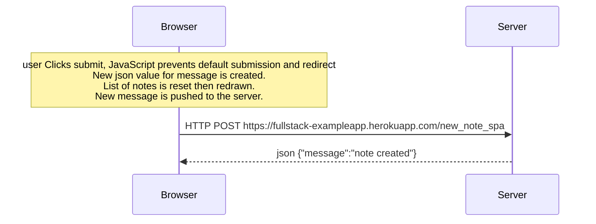

# 0.6 New Note

```mermaid
sequenceDiagram
note over Browser: user Clicks submit, JavaScript prevents default submission and redirect <br> New json value for message is created. <br> List of notes is reset then redrawn. <br> New message is pushed to the server.
Browser ->> Server: HTTP POST https://fullstack-exampleapp.herokuapp.com/new_note_spa
Server -->> Browser: json {"message":"note created"}
```
